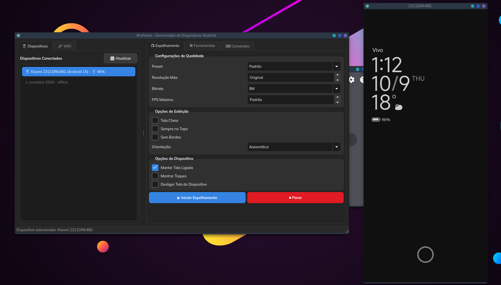

<div align="center">
  
  <h1>AndView - GUI for scrcpy and ADB</h1>
  
  
</div>

A modern Python GUI for managing Android devices using [scrcpy](https://github.com/Genymobile/scrcpy) and ADB (Android Debug Bridge).


📚 Documentação oficial: https://satodu.github.io/AndView/

## 🚀 Installation (Super Easy!)

### For Users: Just Download and Run! 🎉

1. **Download** the latest AppImage from [Releases](https://github.com/satodu/AndView/releases)
2. **Make it executable:**
   ```bash
   chmod +x AndView-*.AppImage
   ```
3. **Run it!**
   ```bash
   ./AndView-*.AppImage
   ```

**That's it!** No installation, no dependencies, no hassle! 🎊

The AppImage includes everything:
- ✅ Python + PySide6
- ✅ ADB (Android Debug Bridge)
- ✅ scrcpy v3.3.3 (latest version)
- ✅ All necessary libraries

Works on **any** Linux distribution! 🐧

### One-Liner Install (Optional)

For quick installation to your Applications folder:

```bash
VERSION="v0.0.3"
FILE="AndView-${VERSION#v}-x86_64.AppImage"
wget "https://github.com/satodu/AndView/releases/download/${VERSION}/${FILE}" \
  && chmod +x "${FILE}" \
  && mkdir -p ~/Applications \
  && mv "${FILE}" ~/Applications/
```

## 📱 Preparing Your Android Device

**⚠️ IMPORTANT:** You MUST enable debug mode on your Android device!

### Quick Setup (2 minutes):
1. **Settings → About phone** → Tap 7x on "Build number"
2. **Settings → Developer options** → Enable "USB debugging"
3. Connect via USB and authorize your computer

👉 **Detailed guide:** [DEBUG_MODE.md](docs/DEBUG_MODE.md)

## ✨ Features

- 🔍 Automatic detection of connected Android devices
- 📱 Screen mirroring with scrcpy (latest version)
- 🎮 Remote device control
- 📊 Detailed device information
- 🔧 Common ADB operations (APK installation, screenshots, etc.)
- 🎨 Modern and intuitive interface with PySide6
- 📶 WiFi connection support

## 📖 Documentation

- 👉 **[START_HERE.md](docs/START_HERE.md)** - Getting started guide
- 🔧 **[DEBUG_MODE.md](docs/DEBUG_MODE.md)** - **⚠️ REQUIRED: Enable debug mode**
- 📚 **[QUICKSTART.md](docs/QUICKSTART.md)** - Quick usage guide
- 🔧 **[TROUBLESHOOTING.md](docs/TROUBLESHOOTING.md)** - Common problems and solutions

## 💻 For Developers

Want to contribute or modify the code? See the [Development Guide](docs/DEV_GUIDE.md).

### Quick Development Setup

```bash
# 1. Clone the repository
git clone https://github.com/satodu/AndView.git
cd AndView

# 2. Run the installer
./scripts/install.sh

# 3. Run in development mode
./dev
```

### Building Your Own AppImage

```bash
./scripts/build_appimage.sh
```

The script will create a fully independent AppImage with everything included!

See [docs/APPIMAGE.md](docs/APPIMAGE.md) for detailed build instructions.

## 🙏 Acknowledgments

This project is powered by the amazing [**scrcpy**](https://github.com/Genymobile/scrcpy) by Genymobile - an incredible tool for displaying and controlling Android devices. Without scrcpy, this GUI wouldn't be possible!

Special thanks to:
- [**scrcpy**](https://github.com/Genymobile/scrcpy) - The core technology behind screen mirroring
- [ADB (Android Debug Bridge)](https://developer.android.com/studio/command-line/adb) - Android's debugging tool
- PySide6 - For the modern GUI framework

## 🤝 Contributing

Contributions are welcome! See [CONTRIBUTING.md](docs/CONTRIBUTING.md) for details.

## 📄 License

MIT License - see [LICENSE](LICENSE) for details.

## 🆘 Help

- Problems? See [docs/TROUBLESHOOTING.md](docs/TROUBLESHOOTING.md)
- Questions? [Open an issue](https://github.com/satodu/AndView/issues)
- Want to contribute? See [CONTRIBUTING.md](docs/CONTRIBUTING.md)

---

Open source, feito com ❤️ no Linux.

**by Panda** ([@eduardo-sato-panda](https://www.linkedin.com/in/eduardo-sato-panda))
